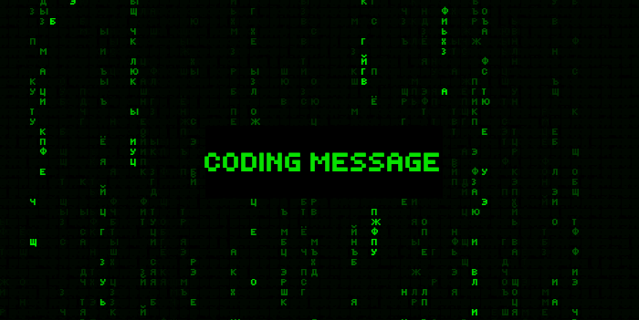

  

# CODING MESSAGE 

  
### [GITHUB PAGES](https://alexxxwhiteee.github.io/codingmessage/) 

Это pet-project, функционал которого заключается в кодировании или расшифровке текстового сообщения.

### Алгоритм работы следующий:
1. Для того, чтобы зашифровать или расшифровать сообщение пользователь вводит число — ключ, без него сделать это не получится.
2. Далее вводится само сообщение.
3. В зависимости от ключа строится массив из букв и допустимых символов, сообщение кодируется — каждая буква заменяется на индекс этой буквы в массиве.
4. Пользователь получает закодированое сообщение в виде набора чисел.
5. Чтобы расшифровать сообщение нужно ввести число - ключ и кодированое сообщение, если ключ соответствует этому сообщению то после обработки данных пользователь получит расшифрованое сообщение.

<h3>🛠 Технологии:</h3>

###

  

